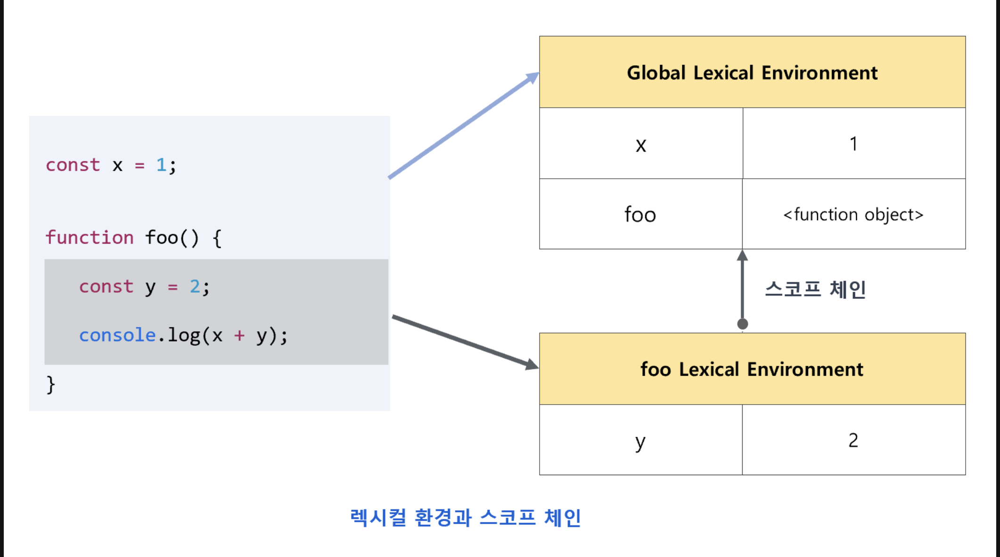
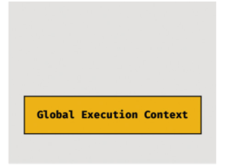
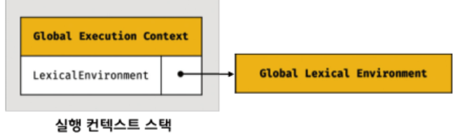
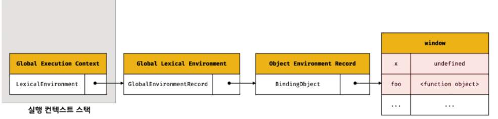
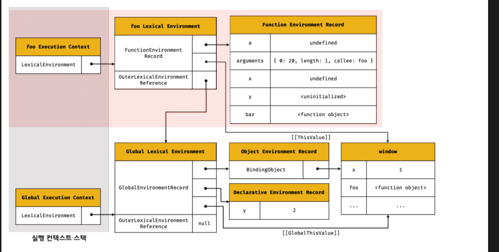
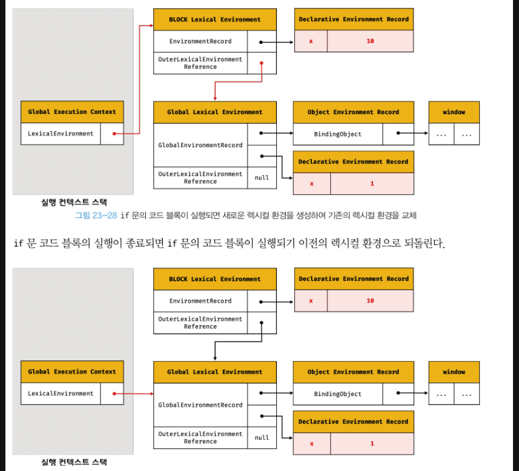

# 실행 컨텍스트 (Execution Context)

## 1) 실행 컨텍스트 개념

실행 컨텍스트는 **자바스크립트의 동작 원리를 담고 있는 핵심 개념**이다.  
실행 컨텍스트를 이해하면 다음을 이해할 수 있다.

- 자바스크립트가 스코프를 기반으로 `식별자`와 `식별자에 바인딩된 값을 관리`하는 방식
- `호이스팅`이 발생하는 이유
- `클로저`가 동작하는 원리
- `태스크 큐`와 `이벤트 핸들러`의 동작 방식
- `비동기 처리`의 동작 방식

즉, 실행 컨텍스트는 코드가 **어떤 환경에서 실행되고, 어떤 변수를 참조할 수 있는지**를 결정하는 실행 단위다.

## 2) 소스코드 타입과 실행 컨텍스트

ESMAScript 사양에 따르면 `소스코드는 4가지 타입`으로 구분된다.  
타입에 따라 실행 컨텍스트 생성 과정과 관리 대상이 달라진다.

### ① `전역 코드` (Global code)

- 프로그램이 시작될 때 가장 먼저 실행되는 코드
- **전역 실행 컨텍스트** 생성
- 전역 변수를 관리하기 위해 전역 스코프 생성
- `var`전역 변수와 `함수 선언문` 함수는 전역 객체(window/global)의 프로퍼티로 등록

  ```js
  var a = 1; // window.a 로 접근 가능
  function foo() {} // window.foo 로 접근 가능

  let b = 2; // window.b ❌ → 전역 렉시컬 환경에만 저장
  ```

### ② `함수 코드` (Function code)

- 함수가 호출될 때 실행되는 코드
- 함수 호출 시마다 **새로운 실행 컨텍스트** 생성
- 지역 스코프, 매개변수, 지역 변수, arguments 객체를 관리
- 함수 스코프는 상위 스코프와 연결되어 **스코프 체인**을 형성

### ③ `eval 코드`(Eval code)

- `eval()` 안에 전달된 문자열이 코드로 실행될 때 사용
  - `일반 모드`: 기존 스코프를 그대로 사용
  - `strict mode`: **독자적인 실행 컨텍스트**와 스코프를 생성

### ④ `모듈 코드`(Module code)

- ES6 모듈(`import` / `export`)에서 실행되는 코드
- 모듈별로 **독립적인 모듈 스코프** 생성
- 전역 스코프와 완전히 분리되어 안전하게 관리됨

---

> 실행 컨텍스트는 **코드 실행에 필요한 환경 정보(스코프, 변수, this 등)** 를 담는 컨테이너다.  
> 소스코드 타입에 따라 서로 다른 실행 컨텍스트가 만들어진다.
>
> > - 전역 코드 → 전역 실행 컨텍스트 (전역 스코프 + 전역 객체)
> > - 함수 코드 → 함수 실행 컨텍스트 (지역 스코프, 지역변수, 매개변수, arguments)
> > - eval 코드 → 독자적인 실행 컨텍스트 (strict mode에서만)
> > - 모듈 코드 → 모듈 실행 컨텍스트 (독립적인 모듈 스코프)

## 3) 소스코드의 평가와 실행

자바스크립트 엔진은 소스코드를 **두 단계**로 나누어 처리한다.

### ① `소스코드의 평가 단계`

1. 실행 컨텍스트 생성
2. 선언문만 먼저 실행
3. 식별자를 `key`로 실행 컨텍스트의 스코프(렉시컬 환경의 **환경 레코드**)에 등록
   - `var` → **선언 + 초기화(undefined)**
   - `let`/`const` → **선언만 (초기화 X, TDZ 상태)**
   - `function` (선언문) → **선언 + 초기화(함수 객체로 바인딩)**

### ② `소스코드의 실행 단계`

1. 선언문을 제외한 **나머지 코드** 순차 실행
   - `let`/`const` 선언문에 도달 → **초기화 수행**
   - 초기화 이후부터 참조 가능
2. 변수 참조/연산 시 → 실행 컨텍스트가 관리하는 스코프에서 검색
3. 실행 결과(걊) → 다시 실행 컨텍스트의 스코프에 반영

## 4) 실행 컨텍스트의 역할

코드 실행을 위해서는 `스코프`, `스코프 내의 식별자`, `코드 실행 순서` 등의 관리가 필요하다.

1. **식별자 관리**

- 선언된 변수, 함수, 클래스 등을 스코프 단위로 구분하여 등록
- 상태 변화를 관리

2. **스코프 체인 유지**

- 스코프 체인을 형성
- 상위 스코프로 연결하여 식별자를 검색 가능하게 함

3. **실행 순서 관리**

- 함수 호출 시 새로운 실행 컨텍스트 생성
- 종료되면 호출한 위치로 되돌아감
- 이 흐름은 **실행 컨텍스트 스택(Call Stack)** 으로 관리

<br />

> `실행 컨텍스트` = **소스코드를 실행하는 데 필요한 모든 환경을 제공하는 컨테이너** + 실행 **결과를 실제로 관리하는 영역**
>
> - 스코프와 식별자 → 렉시컬 환경으로 관리
> - 코드 실행 순서 → 실행 컨텍스트 스택으로 관리
>
> 모든 자바스크립트 코드는 실행 컨텍스트를 통해 실행되고 관리된다.

<br />

## 5) 실행 컨텍스트 스택

생성된 실행 컨텍스트는 스택 자료구조로 관리되며, `실행 컨텍스트 스택`이라 부른다.

```js
const x = 1;

function foo() {
  const y = 2;
  function bar() {
    const z = 3;
    console.log(x + y + z);
  }
  bar();
}

foo();
```


### 실행 컨텍스트의 흐름

1. 전역 코드의 평가와 실행

   - 전역 실행 컨텍스트 생성 ⇒ `실행 컨텍스트 스택`에 push
   - 전역 변수 `x`, 전역 함수 `foo` 등록
   - 전역 코드 실행 ⇒ 값 할당, `foo` 함수 호출

2. `foo` 함수 코드의 평가와 실행

   - 코드 제어권: `foo` 함수로 이동
   - `foo` 함수 실행 컨텍스트 생성 ⇒ `실행 컨텍스트 스택`에 push
   - 지역 변수 `y`, 중첩 함수 `bar` 등록
   - 전역 코드 실행 ⇒ 값 할당, `bar` 함수 호출

3. `bar` 함수 코드의 평가와 실행

   - 코드 제어권: `bar` 함수로 이동
   - `bar` 함수 실행 컨텍스트 생성 ⇒ `실행 컨텍스트 스택`에 push
   - 지역 변수 `z` 등록
   - 전역 코드 실행 ⇒ 값 할당, `console.log` 메서드 호출
   - 함수 종료

4. `foo` 함수 코드로 복귀

   - 코드 제어권: `foo` 함수로 이동
   - `bar` 함수 실행 컨텍스트 ⇒ `실행 컨텍스트 스택`에 pop
   - 함수 종료

5. 전역 코드로 복귀
   - 코드 제어권: 전역코드로 이동
   - `foo` 함수 실행 컨텍스트 ⇒ `실행 컨텍스트 스택`에 pop
   - 전역 종료 ⇒ `실행 컨텍스트 스택`에 pop
   - `실행 컨텍스트 스택`이 비워짐

<br />

> 실행 컨텍스트 스택은 `코드의 실행 순서`를 관리한다.
>
> 1. 소스코드 평가
> 2. 실행 컨텍스트 생성
> 3. 실행 컨텍스트의 최상위에 쌓임
>    > 평가 → 생성 → 스택 push → 실행 → 종료 → 스택 pop  
>    > ⇒ 실행 컨텍스트 **스택의 최상위**는 언제나 **현재 실행 중인 코드의 실행 컨텍스트**이다.

<br />

## 6) 렉시컬 환경

렉시컬 환경은 `식별자`와 `식별자에 바인딩된 값`, `상위 스코프에 대한 참조를 기록`하는 자료구조로 실행 컨텍스트를 구성하는 컴포넌트이다.  
렉시컬 환경은 `스코프`와 `식별자`, `스코프 체인`을 관리`한다.



렉시컬 환경은 키와 값을 갖는 객체 형태의 **스코프를 생성**하여 **식별자**를 키로 등록하고, **식별자와 바인딩된 값을 관리**한다.

렉시컬 환경은 `환경 레코드`와 `외부 렉시컬 환경에 대한 참조`로 구성된다.

#### ① 환경 레코드

> 스코프에 포함된 식별자를 등록하고, 등록된 식별자에 바인딩된 값을 관리하는 **저장소**. 소스 타입에 따라 관리하는 내용에 차이가 있다.

#### ② 외부 렉시컬 환경에 대한 참조

> **상위 스코프를 가리킨다.** 이를 통해 **스코프 체인을 형성**한다.

## 7) 실행 컨텍스트 생성과 식별자 검색 과정

### 1. 전역 객체 생성

- 전역 코드가 평가되기 전에 생성됨
- 전역 객체에는 빌트인 전역 프로퍼티와 빌트인 전역 함수, 그리고 표준 빌트인 객체가 추가됨
- 동작 환경에 따라 Web API 또는 Node.js API가 추가됨

---

### 2. 전역 코드 평가

소스코드가 로드되면 자바스크립트 엔진은 전역 코드를 평가한다.

#### 2.1. 전역 실행 컨텍스트 생성

- 전역 실행 컨텍스트 생성
- 실행 컨텍스트 스택에 push
  

#### 2.2. 전역 렉시컬 환경 생성

- 전역 렉시컬 환경 생성
- 전역 **실행 컨텍스트와 바인딩**
  

> 렉시컬 환경 = `환경 레코드` + `외부 렉시컬 환경에 대한 참조`

#### ① 전역 환경 레코드 생성

전역 렉시컬 환경을 구성하는 컴포넌트인 `전역 환경 레코드`는 `객체 환경 레코드`와 `선언적 환경 레코드`로 구성된다.

1. `객체 환경 레코드` 생성
   

   - 전역 환경 레코드를 구성하는 객체 환경 레코드는 BindingObject라고 부르는 객체와 연결된다. `BindingObject는 전역 객체`를 가리킨다.

   - 전역에서 선언된 var 변수와 함수 선언문으로 정의된 함수는 BindingObject를 통해 전역 객체의 프로퍼티와 메서드가 된다.

   > **변수 호이스팅과 함수 호이스팅의 차이 (함수 선언식)**  
   > `var` 키워드로 선언된 변수는 코드 평가 과정에서 **선언과 초기화가 동시에 이루어진다.** 따라서 실행하는 과정에서 선언문이 없어도 변수를 참조할 수 있다. BUT 항상 `undefined`로 초기화된다.
   >
   > `함수 선언문`은 평가 과정에서 **선언과 해당 함수 객체를 즉시 할당**하기 때문에 선언문 이전에 호출할 수 있다.  
   > 함수 표현식의 경우 `var` 키워드면 변수 호이스팅과 같은 일이 일어난다.

   ***

2. `선언적 환경 레코드` 생성
   - `let`, `const`로 선언한 전역 변수는 선언적 환경 레코드에 등록되고 관리된다.
   - `let`, `const`도 **변수 호이스팅이 발생**하는 것은 변함이 없지만, 코드 실행이 실제로 **선언문에 도달해야 초기화** 된다
   - 그 전까지는 **Temporal Dead Zone(TDZ)** 안에 있어서 참조 불가 → ReferenceError 발생

---

#### ② this 바인딩

- 전역 환경 레코드의 `[[GlobalThisValue]]` 내부 슬롯에 `this`가 저장된다.
- 일반적으로 전역 코드에서 `this`는 **전역 객체(window, global 등)** 를 가리킨다.
- 따라서 전역 코드에서 `this`를 참조하면, 전역 환경 레코드의 `[[GlobalThisValue]]` 내부 슬롯에 바인딩 되어있는 객체가 반환된다. (일반적으로 전역 객체가 반환됨)

> `this` 바인딩은 **전역 환경 레코드**와 **환경 함수 레코드**에만 존재  
>  `객체 환경 레코드`와 `선언적 환경 레코드`에는 없음

---

#### ③ 외부 렉시컬 환경에 대한 참조

- 현재 평가 중인 소스코드를 포함하는 외부 소스코드의 렉시컬 환경, 즉 `상위 스코프`를 가리킨다.
- 전역 코드는 상위 소스코드가 없기 때문에 `null`을 할당하여 스코프 체인의 종점을 의미한다.

---

### 3. 전역 코드 실행

- 전역 코드는 순차적으로 실행된다.
- 변수나 함수 호출 시,
  1.  **실행 중인 실행 컨텍스트**(렉시컬 환경의 환경 레코드)에서 식별자를 먼저 검색
  2.  없으면 **상위 렉시컬 환경으로 이동**하여 검색한다.

---

### 4. `foo` 함수 코드 평가



```js
var x = 1;
const y = 2;

function foo(a) {
  var x = 3;
  const y = 4;
  function bar(b) {
    const z = 5;
    console.log(a + b + x + y + z);
  }
  bar(10);
}

foo(20);
```

- 함수가 호출되면, 전역 코드 실행은 **일시 중단**되고 코드 제어권이 해당 함수로 이동한다.

#### 4.1 함수 실행 컨텍스트 생성

- foo 함수 실행 컨텍스트 생성
- 실행 컨텍스트 스택에 push

#### 4.2 함수 렉시컬 환경 생성

- foo 함수 렉시컬 환경 생성 + foo 함수 실행 컨텍스트에 바인딩

> `함수 렉시컬 환경`의 구성
>
> - 함수 환경 레코드
> - 외부 렉시컬 환경에 대한 참조

#### ① 함수 환경 레코드 생성

- 매개변수, arguments 객체, 함수 내부에서 선언된 지역 변수와 중첩 함수를 등록하고 관리

  ***

#### ② this 바인딩

- 함수 환경 레코드의 `[[ ThisValue ]]` 내부 슬롯에 `this`가 저장된다.
- 바인딩될 객체는 **함수 호출 방식에 따라 결정**된다.
  - `foo`함수는 일반 함수 호출되었으므로 `[[ ThisValue ]]` 내부 슬롯에는 전역객체가 바인딩된다.
  ***

#### ③ 외부 렉시컬 환경에 대한 참조

- 함수의 **외부 렉시컬 환경 참조**는 함수가 **정의될 때** 결정된다.
- 즉, 함수는 **호출 위치가 아니라 정의된 위치**에 따라 상위 스코프가 정해진다. (렉시컬 스코프)
- 자바스크립트 엔진은 함수 정의 시, **현재 실행 컨텍스트의 렉시컬 환경(함수의 상위 스코프)**을 함수 객체의 `[[Environment]]` 내부 슬롯에 저장한다.
- 이 슬롯이 함수 렉시컬 환경의 **외부 렉시컬 환경 참조**에 연결되어, 렉시컬 스코프가 구현된다.

  ***

### 5. `foo` 함수 코드 실행

- 런타임이 시작되어 foo 함수의 소스코드가 순차적으로 실행된다.
  - 매개변수에 인수 할당
  - 변수 할당문이 실행 → 지역 변수에 값이 할당
- 식별자 결정
  - 실행 중인 실행 컨텍스트의 렉시컬 환경에서 식별자 검색
  - 해당 렉시컬 환경에 없으면 `외부 엑시컬 환경에 대한 참조`가 가르키는 렉시컬 환경으로 이동하여 식별자 검색
- 검색된 식별자에 값을 바인딩

---

### 6. 함수 코드 실행 종료

- 더 이상 실행할 코드가 없으면 함수 코드의 실행이 종료된다.
- 이때 실행 컨텍스트 스택에서 함수 실행 컨텍스트가 pop되어 제거된다.
- `코드의 제어권`은 실행 컨텍스트 스택의 최상위에 위치한 전역 실행 컨텍스트로 이동한다.
  - 스택에서 실행 컨텍스트가 제거되었다고 해서 **함수 렉시컬 환경까지 즉시 소멸되는 것은 아니다.**
  - 렉시컬 환경과 실행 컨텍스트는 독립적인 객체다
  - 모든 값은 누군가에게 참조되지 않을 때, **가비지 컬렉터**에 의해 메모리 공간의 확보가 해제되어 소멸한다.  
    ⇒ 즉, foo 함수 실행 컨텍스트가 스택에서 pop 되었더라도, **누군가 foo 함수 렉시컬 환경을 참조하고 있다면**, 해당 함수 렉시컬 환경은 **소멸되지 않는다.**

---

### 7. 전역 코드 실행 종료

- 더 이상 실행할 코드가 없으면 전역 코드의 실행이 종료된다.
- 이때 실행 컨텍스트 스택에서 전역 실행 컨텍스트가 pop되어 제거되고, 스택에는 아무것도 남지 않게 된다.

<br />

## 8) 실행 컨텍스트와 블록 레벨 스코프

- `var` : **함수 레벨 스코프**(함수의 코드 블록만 지역 스코프로 인정)
- `let` / `const` : **블록 레벨 스코프** (모든 코드 블록을 지역 스코프로 인정)

  ```js
  if (true) {
    var x = 10;
  }

  console.log(x); // 10
  ```

  ```js
  let x = 1;
  if (true) {
    let x = 10;
  }
  cosnole.log(x); // 1
  ```



### 블록 레벨 스코프 동작 과정

1. **if 블록 진입 시**

   - **블록 전용 실행 컨텍스트(블록 레벨 스코프)** 가 만들어진다.
   - 이를 위해 선언적 환경 레코드를 갖는 **새로운 렉시컬 환경**이 생성되고, 기존 전역 렉시컬 환경을 잠시 교체한다.
   - 이때 생성된 블록 렉시컬 환경의 **외부 렉시컬 환경 참조**는 전역 렉시컬 환경을 가리킨다.

2. **if 블록 종료 시**

   - 실행이 끝나면 블록 전용 렉시컬 환경이 사라지고,
   - 다시 **이전(전역) 렉시컬 환경**으로 되돌아간다.
   - 이 로직은 모든 블록문(`if`, `while`, `for`, `{ }` 등)에 동일하게 적용된다.

---

### for문과 블록 레벨 스코프

- `for`문에서 **`let`** 을 쓰면, **반복할 때마다 새로운 렉시컬 환경**이 생성된다.
- 즉, 매 반복마다 `i` 같은 변수가 **독립적으로 존재**한다.

  ```js
  for (let i = 0; i < 3; i++) {
    setTimeout(() => console.log(i), 0);
  }
  // 0 → 렉시컬 환경 A 안에 `i=0`
  // 1 → 새 렉시컬 환경 B 안에 `i=1`
  // 2 → 새 렉시컬 환경 C 안에 `i=2`
  ```
- 만약 `var`였다면 하나의 환경만 공유되므로 `2, 2, 2`이 출력된다.

   > 1.  `i=0` → 렉시컬 환경 A 안에 `i=2`
   > 2.  `i=1` → 렉시컬 환경 A 안에 `i=2`
   > 3.  `i=2` → 렉시컬 환경 A 안에 `i=2`

<br />

- `for` 블록 안에서 정의된 함수의 **상위 스코프**는 해당 반복에서 만들어진 렉시컬 환경을 가리킨다.
- 그래서 매 반복마다 변수 값이 “캡쳐”되어 유지된다.
  
---

- **if/while 같은 블록** → 새 환경은 "한 번만" 생겼다가 블록 끝나면 사라짐.
- **for(let)** → "매 반복마다" 새 환경이 생겨서, 함수 클로저가 다른 값들을 따로따로 보관 가능 (특수 케이스)
