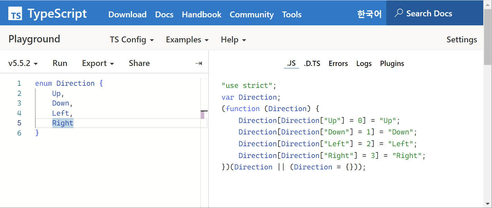

# 2.2 타입스크립트의 타입 시스템

## 1. 타입 애너테이션 방식

- **타입 애너테이션** : 변수나 함수에 대해 **타입을 명시적으로 선언**하여, 어떤 값이 저장될지 컴파일러에 직접 알려주는 문법.

언어마다 타입을 명시해주는 방법은 다름.

### 타입스크립트의 타입 선언 방식

- 변수 이름 뒤에 `:type` 구문을 붙임.
- 타입스크립트는 기존 자바스크립트 코드에 `점진적으로 타입을 적용`할 수 있는 특징이 있음.  
  ➡︎ 코드에서 `:type 구문`을 제거해도 정상 동작 O  
  ➡︎ 하지만 타입 제거 시 타입 추론 과정에서 어려움이 발생할 수 있음.

```typescript
let isDone: boolean = false; // boolean 타입
let decimal: number = 6; // number 타입
let color: string = "blue"; // string 타입
let list: number[] = [1, 2, 3]; // number 타입 배열
let x: [string, number]; // tuple 타입
x = ["hello", 10]; // string과 number 순서로 구성된 튜플
```

## 2. 구조적 타이핑

타입스크립트는 **구조적 타이핑(structural typing) 방식**을 채택함.  
이를 통해 `값의 구조`에 따라 타입이 결정됨.

### 1) **명목적 타입 시스템(Nominal Typing)**

     타입을 사용하는 대부분의 프로그래밍 언어에서는 `명목적 타입 시스템`을 가짐.

- **명목적 타입 시스템**은 타입의 **이름**을 기준으로 값을 구분함.
  - 값을 담고 있는 객체나 변수는 **구체적인 타입 이름**을 가짐.
  - 타입 이름이 다르면, 구조가 같더라도 서로 다른 타입으로 간주함. (**타입 이름 자체가 다르면 호환 불가**)
    - `개발자가 의도한 타입이 아닌 경우 에러가 발생`하므로, 타입의 동일성을 확인하는 데 구조적 타이핑보다 더 `안정적`임.
  - 일반적으로 상속관계나 명시적인 인터페이스를 사용해 타입 간 호환성을 명확히 정의해야함.
    - 명확한 상속관계나 공통 인터페이스가 없다면 서로 다른 클래스끼리 타입이 호환되지 않음.
  - 컴파일 타임 이후에도 남아있음.
- 명목적 타이핑 사용언어 : C++, Java

#### 예제 - 명목적 타입 시스템

```typescript
class Dog {
  sound() {
    return "Bark";
  }
}

class Cat {
  sound() {
    return "Meow";
  }
}

const animal: Dog = new Cat(); // 🚨 오류 발생 - 이름이 다른 타입 간 할당 불가능
```

### 2) 구조적 타이핑(Structural Typing)

- **구조적 타이핑**은 타입의 **구조**를 기준으로 값을 구분함.
- 즉, 타입의 이름보다는 타입이 어떤 속성을 가지고 있는지가 중요함.
  - 타입 이름과 관계없이 **속성의 구성과 타입이 같으면 같은 타입으로 간주함.** (**구조가 동일하면 이름에 관계없이 호환 가능**)
  - 이를 통해 타입 간 호환성이 유연하게 적용됨.
- 구조적 타이핑 사용언어 : TypeScript

#### 예제 1 - 구조적 타이핑

```typescript
interface Animal {
  sound(): string;
}

class Dog {
  sound() {
    return "Bark";
  }
}

class Cat {
  sound() {
    return "Meow";
  }
}

const animal: Animal = new Dog(); // ✅ 정상 동작 - 구조가 같기 때문에 호환 가능
const animal: Animal = new Cat(); // ✅ 정상 동작 - 구조가 같기 때문에 호환 가능
```

`Dog`와 `Cat` 클래스는 모두 `sound` 메서드를 가지므로, `Animal` 타입에 할당이 가능

#### 예제 2 - 구조적 타이핑

```typescript
interface Developer {
  faceValue: number;
}

interface BankNote {
  faceValue: number;
}

let developer: Developer = { faceValue: 28 };
let bankNote: BankNote = { faceValue: 1000 };

developer = bankNote; // ✅ OK
bankNote = developer; // ✅ OK
```

`Developer`와 `BankNote` 인터페이스는 모두 `faceValue`라는 속성을 가지며, 타입은 `number`로 동일한 구조를 가지고 있음.  
타입스크립트는 두 인터페이스가 이름이 달라도, **구조가 동일**하기 때문에 **호환 가능**하다고 판단함.

## 3. 구조적 서브타이핑(Structural Subtyping)

타입스크립트의 타입 시스템은 `값의 집합`으로 이해할 수 있음.  
➡︎ 타입스크립트에서는 특정 값이 `string` 또는 `number` 타입을 **동시에** 가질 수 있음.

```typescript
type stringOrNumber = string | number;
```

### 1) **구조적 서브타이핑(Structural Subtyping)**

타입스크립트의 타입 시스템에서 중요한 개념으로, 값의 **구조(속성)** 에 따라 타입 간 서브타입 관계를 결정함.

- 타입 A가 타입 B의 서브타입이 되려면, A는 B가 요구하는 모든 속성을 포함해야 함.
- 타입스크립트에서는 더 많은 속성을 가진 타입이 더 적은 속성을 가진 타입에 할당 가능.

#### 예제 - 구조적 서브타이핑

```typescript
interface Pet {
  name: string;
}

interface Cat {
  name: string;
  age: number;
}

let pet: Pet;
let cat: Cat = { name: "Kitty", age: 2 };

pet = cat; // ✅ OK
```

- `Pet`은 `name: string` 속성만 필요로 함.
- `Cat`은 `name: string`과 `age: number` 속성을 가지지만, **`name` 속성을 포함하므로** `Pet` 타입으로 호환 가능.  
  ➡︎ 더 많은 속성을 가진 타입(`Cat`)은 더 적은 속성을 요구하는 타입(`Pet`)에 할당될 수 있다!

---

#### 📌 타입스크립트의 타입 시스템과 실체 객체

타입스크립트는 **컴파일 타임**에만 타입을 확인하며, 실제 실행 시에는 **타입 정보가 제거**됩니다.  
즉, 타입스크립트에서 `pet` 변수에 `cat` 객체를 할당해도, 실제 객체(`cat`)는 여전히 원래의 속성을 유지합니다.

```typescript
console.log(pet); // { name: "Kitty", age: 2 } -> `cat` 객체가 그대로 출력됨
```

- `pet` 변수는 `Pet` 타입으로 선언되었지만, 타입스크립트는 객체의 구조적 서브타이핑을 통해 **타입 호환성을 허용할 뿐**, 실제 객체는 **원래의 속성을 그대로** 가지고 있음.

#### 📌 속성에 접근하려고 하면 오류 발생

`pet` 변수는 `Pet` 타입으로 선언되었기 때문에, **`Pet`에 정의된 속성만 사용할 수 있음.**

```typescript
// 속성에 접근하려고 하면 오류 발생
console.log(pet.name); // "Hey" -> 정상 작동
console.log(pet.age); // 오류! 'Pet' 타입에는 'age' 속성이 없음

console.log(cat.age); // 2 -> cat은 여전히 'age' 속성을 가지고 있음
```

- 타입스크립트는 `pet` 변수를 `Pet` 타입으로 인식하므로, `Pet`에 정의되지 않은 속성(`age`)에 접근하려고 하면 오류를 발생시킴.

#### 📌 타입 단언 사용 시 `pet`에서 `age`속성에 접근 가능

```typescript
console.log((pet as Cat).age); // 2 -> 'Cat'으로 타입 단언 후 접근 가능
```

---

### 2) 구조적 서브타이핑의 함수 적용

#### 예제 - 함수 매개변수에서 서브타이핑

```typescript
interface Pet {
  name: string;
}

let cat = { name: "Kitty", age: 2 };

function hello(pet: Pet) {
  console.log("Hello, " + pet.name);
}

hello(cat); // "Hello, Kitty"
```

- 함수 `hello()`는 `Pet` 타입을 받도록 설계되었지만, `cat` 객체를 전달해도 정상적으로 동작함.
- `cat` 객체가 `Pet` 타입에서 요구하는 `name` 속성을 포함하기 때문.

### 3) 클래스와 구조적 서브타이핑

#### 예제 - 타입 상속에서 서브타이핑

```typescript
class Person {
  name: string;
  age: number;

  constructor(name: string, age: number) {
    this.name = name;
    this.age = age;
  }
}

class Developer {
  name: string;
  age: number;
  sleepTime: number;

  constructor(name: string, age: number, sleepTime: number) {
    this.name = name;
    this.age = age;
    this.sleepTime = sleepTime;
  }
}

function greet(person: Person) {
  console.log("Hello, " + person.name);
}

const developer = new Developer("Danbi", 20, 7);
greet(developer); // "Hello, Danbi"
```

- `greet()` 함수는 `Person` 타입을 매개변수로 받음.
- `Person` 타입은 `name: string`과 `age: number` 속성을 요구함
- `Developer` 클래스는 `name: string`과 `age: number`, `sleepTime: number` 속성을 가짐.
  - `Developer` 타입은 `sleepTime` 속성을 추가로 가지지만, 타입스크립트는 필요 없는 추가 속성을 무시.
  - 런타임에서 실제 객체(`developer`)는 `sleepTime` 속성을 포함한 원래의 상태를 유지함.
  - `greet` 함수는 `person.name`에만 접근하므로, 다른 속성(`sleepTime`)은 사용되지 않음!
- `Developer`는 `Person`의 요구사항인 **`name`과 `age` 속성을 포함하고 있으므로**, **타입스크립트는 `Developer`를 `Person` 타입으로 간주할 수 있음**
- 따라서 `Developer`의 인스턴스(`developer`)를 `Person` 타입으로 사용할 수 있다.

서로 다른 두 타입간의 호환성은 오로지 타입 내부 구조에 의해 결정된다.  
타입 A가 타입 B의 서브타입이라면(=타입 A가 타입 B의 모든 속성과 타입을 포함하고 있다면), A타입의 인스턴스는 B타입이 필요한 곳에 언제든지 위치할 수 있다.

### ✅ 구조적 서브타이핑의 요점

1. **타입은 이름이 아니라 구조로 판단**된다.
   - `Person`과 `Developer`는 이름이 다르지만, 구조적으로 호환된다.
2. **더 많은 속성을 가진 타입은 더 적은 속성을 가진 타입에 할당 가능**하다.

   - `Developer`는 `Person`이 요구하는 모든 속성을 포함하므로 `Person` 타입으로 사용할 수 있다.

3. **런타임 객체는 변하지 않는다.**
   - 타입스크립트의 타입 체크는 컴파일 타임에만 작동하므로, 런타임 객체(`developer`)는 여전히 모든 속성을 유지한다.

---

## 4. 자바스크립트를 닮은 타입스크립트

타입스크립트가 `구조적 타이핑`을 채택한 이유는 타입스크립트가 자바스크립트를 모델링한 언어이기 때문이다.

- 자바스크립트는 `덕 타이핑(duck typing)`을 기반으로 동작함
  - **덕 타이핑** : 함수의 매개변수 값이 요구하는 속성을 갖추고 있다면, 그 값이 어떤 방식으로 생성되었는지는 중요하지 않음.  
    _ex. 만약 어떤 새가 오리처럼 걷고 `꽥꽥`거리고 `헤엄`친다면, 우리는 그 새를 `오리`라고 부를 것이다. 🦆_

`쉬운 사용성`과 `안전성`을 중시하는 타입스크립트는 객체 간 속성이 동일하다면 서로 호환되는 **구조적 타입 시스템**을 제공하여 유연한 타이핑과 편리성을 높임.

### 1) 덕 타이핑 vs 구조적 타이핑

자바스크립트의 덕 타이핑과 타입스크립트의 구조적 타이핑은 객체의 속성을 기반으로 타입을 검사한다는 공통점이 있지만, **타입 검사 시점**에서 차이가 있다.

|                 | **덕 타이핑** | **구조적 타이핑** |
| --------------- | ------------- | ----------------- |
| **사용 언어**   | 자바스크립트  | 타입스크립트      |
| **검사 시점**   | 런타임        | 컴파일 타임       |
| **타이핑 방식** | 동적 타이핑   | 정적 타이핑       |

## 5. 구조적 타이핑의 결과

구조적 타이핑의 특징 때문에 **예기치 못한 결과**가 나올 때가 있다.

#### 예제 1 - 예상과 다른 타입 에러

```typescript
interface Cube {
  width: number;
  height: number;
  depth: number;
}

function addLines(c: Cube) {
  let total = 0;

  for (const axis of Ojbect.keys(c)) {
    // 🚨 오류: 'c[axis]'의 타입을 'number'로 확정할 수 없음
    const length = c[axis];

    total += length; // Element implicitly has an 'any' type 오류
  }
}
```

- `addLines()` 함수의 매개변수 ``c`가 `Cube` 타입으로 선언됨.
- `Cube` 인터페이스는 `width`, `height`, `depth` 속성을 모두 `number` 타입으로 정의함.
- 그래서 당연히 `c[axis]`는 `number` 타입일 것이라 예측함.
- 🚨 **하지만 `구조적 타이핑의 특성`으로 인해 `c`는 `Cube`의 외에도 추가로 어떤 속성이든 가질 수 있음**
  - 타입스크립트는 `c[axis]`가 항상 `number`일 것이라고 확신할 수 없음
  - `c[axis]`의 타입이 string일 수도 있어 에러 발생

#### 예제 2 - 추가 속성이 포함된 객체

```typescript
const sampleCube = {
  width: 6,
  height: 5,
  depth: 4,
  name: "sweetCube", // string 타입의 추가 속성
};

addLines(sampleCube); // ✅ OK - 구조적 타이핑으로 문제 없음
```

- `sampleCube`는 `Cube` 타입의 구조를 포함하면서도 `name` 같은 추가 속성을 가질 수 있음.
- 타입스크립트는 런타임에 `name` 같은 속성이 들어오지 않을 것을 보장할 수 없으므로, **`c[axis]`의 타입을 `any`로 추론함.**
- **결과적으로, `c[axis]`의 타입을 `number`로 확정할 수 없어서 오류가 발생합니다.**

이러한 한계 때문에 타입스크립트에 명목적 타이핑 언어의 특징을 가미한 `유니온` 같은 방법이 생겨남.

## 6. 타입스크립트의 점진적 타입 확인

타입스크립트는 점진적으로 타입을 확인하는 언어다.

### 1) 점진적 타입 검사

- **점진적 타입 검사** : 컴파일 타임에 타입을 검사하면서 필요에 따라 타입 선언 생략을 허용하는 방식.
  - 타입을 지정한 경우: `정적`으로 타입을 검사.
  - 타입을 생략한 경우: `동적`으로 타입을 검사(`any`로 추론).

#### 예제 - 타입 선언 생략 시의 `암시적 타입 변환`

```typescript
function(x,y){
  return x+y
}
//위 코드는 아래와 같이 암시적 타입 변환이 일어난다.
function(x:any, y:any):any
```

x, y에 타입을 선언하지 않았으나 타입스크립트 컴파일러는 x, y가 잘못된 것이라 여기지 않는다. 다만, 타입을 명시하지 않았기에 `any` 타입으로 추론한다.

### 2) 타입스크립트의 유연성

타입스크립트는 필요에 따라 타입을 생략할 수도, 타입을 점진적으로 추가할 수도 있다. 즉 **컴파일하는 데 모든 타입을 반드시 알아야 하는 것은 아니다**. 그저 모든 타입을 알고 있을 때 최상의 결과를 보여준다.

타입스크립트는 자바스크립트의 슈퍼셋 언어이기 때문에 `.ts` 파일에 자바스크립트 문법으로 코드를 작성하여도 문제가 발생하지 않는다. 타입이 없는 자바스크립트 코드를 타입스크립트로 마이그레이션할 때, 타입스크립트의 점진적 타이핑이라는 특징을 유용하게 활용할 수 있다.

#### 예제 - 자바스크립트 코드를 타입스크립트로 마이그레이션

```javascript
// 기존 자바스크립트 코드
const greet = (name) => console.log(`Hello, ${name}!`);
```

```typescript
// 타입스크립트로 변환 (점진적 타입 추가)
const greet = (name: string): void => console.log(`Hello, ${name}!`);
```

## 7. 자바스크립트 슈퍼셋으로서의 타입스크립트

타입스크립트는 기존 자바스크립트 코드에 정적인 타이핑을 추가한 것으로 **자바스크립트의 상위 집합**이다.

- 타입스크립트 문법은 모든 자바스크립트 문법을 포함한다.
- 모든 타입스크립트 코드가 자바스크립트 코드인 것은 아니다.

```javascript
function hello(name: string) {
  console.log("Hello", name);
}
```

- 타입스크립트에서는 유효함
- 자바스크립트 런타임에서는 오류가 발생함(`:string`은 타입스크립트에서 쓰는 타입 구문이기 때문)

## 8. 값 vs 타입

### 1) 자바스크립트의 값

- **값** : 프로그램이 처리하기 위해 메모리에 저장하는 모든 데이터
  - 문자열, 숫자, 변수, 매개변수 등
  - 자바스크립트에서는 객체와 함수도 값이다.
    (모든 것이 객체인 언어답게 자바스크립트 함수는 런타임에 객체로 변환되기 때문)

### 2) 타입스크립트의 값과 타입

자바스크립트 대신 타입스크립트응 사용하게 되면서 타입이라는 개념이 등장한다.

#### 타입스크립트의 타입 명시

타입스크립트는 변수, 매개변수, 객체 속성 등에 다음과 같이 타입을 명시한다.

- `:type` 형태로 타입 정의
- `type` 키워드 커스텀 타입 정의
- `interface` 키워드로 커스텀 타입 정의

타입과 변수를 같은 이름으로 정의할 수 있다.

- 이는 `값 공간`과 `타입 공간`의 이름은 서로 충돌하지 않기 때문이다
- **type으로 선언된 내용은 자바스크립트 런타임에서 제거되기 때문에 `값 공간`과 `타입 공간`은 서로 충돌하지 않는다.**

```typescript
type Developer = { isWorking: true };
const Developer = { isTyping: true }; // ✅ ok

type Cat = { name: string; age: number };
const Cat = { color: "blue" }; // ✅ ok
```

- 타입스크립트 코드에서 `값` : 할당 연사자(`=`) 사용
- 타입스크립트 코드에서 `타입` : 타입 선언(`:`) 또는 단언문(`as`) 사용

### 3) 값과 타입이 혼동되는 경우

함수의 매개변수처럼 여러개의 심볼이 함께 쓰인다면 타입과 값을 명확히 구분해야 한다.

타입스크립트에서 값과 타입은 함께 사용되지만 별로의 네임스페이스에 존재한다.
값이 사용되는 위치와 타입이 사용되는 위치가 다르기 때문에 타입스크립트가 문맥을 파악하여 타입인지 값인지를 추론하는 것이다.

```typescript
function email(options: { person: Person; subject: string; body: string }) {
  //...
}
```

하지만 값과 타입의 구분은 맥락에 따라 달라지기 때문에 혼동될 때도 있다.

위 코드를 자바스크립트의 구조 분해 할당을 사용하면 다음과 같지만

```javascript
function email({ person, subject, body }) {
  //...
}
```

이를 타입스크립트에서 구조 할당 분해하면 오류가 발생한다.

```typescript
function email({
  person: Person, // 🚨 값의 관점에서 해석됨
  string, // 🚨 값의 관점에서 해석됨
  string, // 🚨 값의 관점에서 해석됨
}) {
  //...
}
```

이와 같은 문제를 해결하기 위해,

자바스크립트의 **구조 분해 할당**을 사용할 땐 **`값-타입 공간`을 혼동하지 않도록 구분해서 작성해야 한다!**

```typescript
function email({
  person,
  subject,
  body,
}: {
  person: Person;
  subject: string;
  body: string;
}): {
  //...
};
```

### 4) 값과 타입 공간에 동시에 존재하는 심볼

대표적으로 `클래스`와 `enum`은 값과 타입 공간 모두에 포함될 수 있다.

#### 클래스

타입스크립트에서 클래스는 타입 애너테이션으로 사용할 수 있지만,  
 런타임에서 객체로 변환되어 자바스크립트 값으로 사용되는 특징이 있다.

#### 예제 - 클래스

```typescript
class Developer {
  name: string;
  age: number;

  constructor(name: string, age: number) {
    this.name = name;
    this.age = age;
  }
}

const me: Developer = new Developer("Danbi", 20);
```

`me`에서 `:Developer`은 **타입**에 해당하지만 `new Developer`는 **클래스의 생성자 함수**인 **값**으로 동작함

#### enum

enum 역시 `런타임`에서 객체로 변환되는 **값**이다.


enum 예시를 순수 자바스크립트 코드로 컴파일하면(우측 코드) 위와 같다.  
enum도 클래스처럼 타입과 값 둘다 사용될 수 있다.

### 5) 타입스크립트에서 자바스크립트 키워드가 해석되는 방식

| **키워드**            | **값** | **타입** |
| --------------------- | ------ | -------- |
| `class`               | O      | O        |
| `const`, `let`, `var` | O      | X        |
| `enum`                | O      | O        |
| `function`            | O      | X        |
| `interface`           | X      | O        |
| `type`                | X      | O        |
| `namespace`           | O      | X        |

## 9. 타입을 확인하는 방법

타입스크립트에서 typeof, instanceof 그리고 타입 단언을 사용해서 타입을 확인할 수 있다.

### 1) `typeof`를 사용한 타입 확인

- `typeof` : 연산하기 전에 피연산자의 데이터 타입을 나타내는 문자열을 반환함

#### 예제

```typescript
console.log(typeof 2025); // "number"
console.log(typeof "danbi"); // "string"
console.log(typeof true); // "boolean"
console.log(typeof {}); // "object"
```

#### `typeof`의 반환값

- 기본 타입: `"boolean"`, `"number"`, `"string"`, `"bigint"`, `"undefined"`, `"symbol"`, `"object"`.
- 함수: `"function"`.

`typeof`는 타입에서 쓰일 때와 값에 쓰일때 역할이 다르다.

#### 1. **값의 타입 확인 (런타임)**

값에서 사용된 typeof는 자바스크립트 런타임에 데이터 타입을 확인할 때 사용된다.

```typescript
const v1 = typeof person; // "object"
const v2 = typeof email; // "function"
```

- `v1`은 변수 `person`의 런타임 데이터 타입이 `"object"`임을 나타냄
- `v2`는 변수 `email`의 런타임 데이터 타입이 `"function"`임을 나타냄

#### 2. **타입 추론 (컴파일 타임)**

`typeof`를 **타입**으로 사용하면 변수나 객체의 타입을 추론할 수 있다.

```typescript
type t1 = typeof person; // 타입이 'Person'
type t2 = typeof email; // 함수의 타입 (object:{ person: Person, ... } 등)
```

- `t1`: `person` 변수의 타입이 `Person` 인터페이스로 추론됨
- `t2`: `email` 함수의 매개변수 타입과 리턴 타임을 포함한 함수 시그니처 타입을 반환함

---

### 2) **`instanceof`를 사용한 타입 확인**

`instanceof`는 객체가 특정 클래스의 인스턴스인지 확인하는 데 사용한다.

#### 예제

```typescript
class Person {}
const p = new Person();

console.log(p instanceof Person); // true
console.log(p instanceof Object); // true
```

#### `instanceof` 사용법

- **왼쪽**: 검사할 객체.
- **오른쪽**: 검사할 클래스(또는 생성자 함수).

- `instanceof` 연산자는 객체의 상속 관계를 확인해 특정 타입(클래스나 생성자 함수)에 속하는지 검사함
- 타입을 확인한 뒤, 타입이 보장된 상태에서 객체를 사용할 수 있음

---

### 3) **`as` 키워드를 사용한 타입 단언 (Type Assertion)**

타입스크립트에서는 `as` 키워드를 사용해 값을 특정 타입으로 **강제**할 수 있다. 이를 **타입 단언(Type Assertion)** 이라고 한다.

#### 예제

```typescript
let not_yet_text: unknown;

const validateText = (text: string) => {
  if (text.length < 10) return "최소 10글자 이상 입력해야 합니다.";
  return "정상 입력된 값입니다.";
};

validateText(not_yet_text); //Argument of type 'unknown' is not assignable to parameter of type 'string'.

validateText(not_yet_text as string); // as 키워드를 사용해서 강제 변환
```

- `unknown` 타입 값을 함수 인자로 쓰려고 할 때 타입 에러가 발생한다.
- `as 키워드`를 사용해서 `string`으로 강제하면 에러가 발생하지 않게 된다.

#### 타입 단언의 목적

- 컴파일러에게 **"이 값은 특정 타입으로 간주해도 된다"** 고 알려줌
- `unknown` 또는 `any` 타입 값을 구체적인 타입으로 변환할 때 유용함
