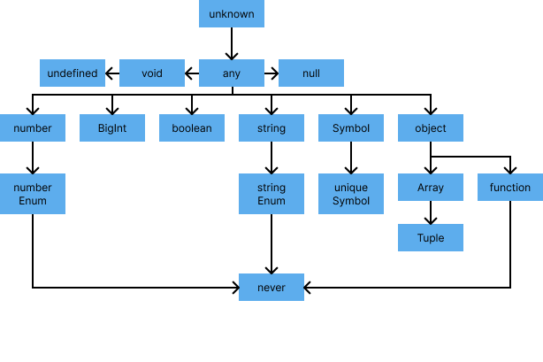
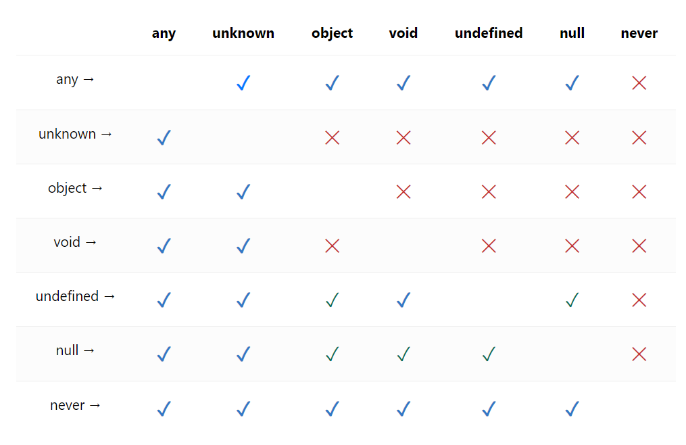

# 3.1 타입스크립트만의 독자적 타입 시스템

타입스크립틑 자바스크립 자료형에 제시되지 않은 독자적인 타입 시스템을 가지고 있다. 하지만 이 개념은 모두 자바스크립트에 기인한 것이다.

## 1. 타입스크립트의 타입 계층 구조



### 1) any 타입

`any`타입은 자바스크립트에 존재하는 모든 값을 **오류없이 받을 수 있는 타입**이다.  
즉, 타입을 명시하지 않은 것과 동일한 효과를 나타낸다.

#### 예제 - 어떤 값을 할당해도 문제 없는 any 타입

```typescript
let state: any;

state = { value: 0 }; // ✅ 객체를 할당해도
state = 100; // ✅ 숫자를 할당해도
state = "hello world"; // ✅ 문자열을 할당해도
state.inner = () => console.log("any type"); // ✅ 중첩구조로 들어가 함수를 할당해도 문제없음
```

#### **`any` 타입의 장점과 단점**

- **장점**

  - **편의성**: 개발 초기 단계에서 빠르게 작업 가능.
  - **유연성**: 어떤 값이든 허용되므로 사용 범위가 넓음.

- **단점**
  - **안전성 저하**: 타입스크립트의 정적 타이핑 목적에 어긋남.
  - **디버깅 어려움**: 타입 정보가 손실되어 오류를 추적하기 어려움.
  - **협업 문제**: 타입이 명확하지 않아 다른 개발자와 협업 시 혼란 초래.

이러한 단점때문에 `any` 타입은 그 사용을 지양해야 한다.  
하지만 아래와 같이 **어쩔 수 없이 any 타입을 사용해야 하는 경우**가 있다.

#### 📌 any 타입을 사용하는 대표적인 경우

**1. 개발 단계에서 값을 지정해야 할 때**

- 복잡한 시스템에서 추후 값이 변경될 가능성이 있거나, 타입이 아직 확정되지 않은 경우 임시로 사용할 수 있다.
- **주의**: 개발 완료 후 반드시 구체적인 타입으로 대체해야 안전성을 확보할 수 있음

```typescript
let temp: any;
// 추후 결정될 타입
temp = fetchData(); // API 응답 후 타입 결정
```

**2. 어떤 값을 받아올지 또는 넘겨줄지 정할 수 없을 때**

- 외부 API 호출이나 콜백 함수에서 반환 타입이 불명확한 경우.
- ex. API 요청 및 응답, 콜백 함수 전달, 동적 데이터를 처리할 때 등 어떤 값의 타입을 명확하게 정하기 힘든 경우 사용할 수 있음

```typescript
function handleApiResponse(response: any) {
  if (typeof response === "object") {
    console.log("Received object:", response);
  } else {
    console.log("Unexpected response type:", typeof response);
  }
}
```

**3. 값을 예측할 수 없을 때 암묵적으로 사용**

- 특정 외부 라이브러리가 타입 정보를 제공하지 않거나, 브라우저의 Fetch API 등에서 반환되는 값이 불확실한 경우.

```typescript
async function load() {
  const response = await fetch("https://api.com");
  const data = await response.json(); // response.json()의 리턴 타입은 Promise<any>로 정의되어 있음

  return data;
}
```

> 브라우저의 Fetch API의 일부 메서는 요청 이후의 응답을 특정 포맷으로 파싱하는데 이때 반환 타입이 `any`로 매핑되어 있는 것을 확인 할 수 있다.

---

### 2) unknown 타입

`unknown`타입은 **무엇이 할당될지 아직 모르는 상태의 타입**을 나타낸다.  
`any`타입처럼 **모든 타입의 값을 할당**할 수 있지만, **`unknown` 타입 값을 다른 변수에 할당하려면 타입 검사가 필요**하다.

>  > `any`를 제외하고 **다른 타입으로 선언된 변수에는 `unknown` 타입 값을 할당할 수 없다.**

#### **`unknown` 타입의 특징**

1. **모든 값이 할당 가능**
   - `unknown` 타입 변수는 숫자, 문자열, 함수 등 어떤 값이든 할당할 수 있다.
2. **다른 변수에 할당 시 타입 검사 필요**
   - `any` 타입과 달리, `unknown` 타입의 값은 다른 변수로 바로 할당할 수 없다.
3. **값에 직접 접근하거나 내부 속성에 접근 불가능**
   - 타입스크립트는 **안전성을 보장하기 위해**, `unknown` 타입으로 선언된 변수에 직접적으로 값을 가져오거나 속성에 접근하는 것을 금지한다.

#### 예제 1 - 값 할당 및 타입 검사

```typescript
let unknownValue: unknown;

unknownValue = 100; // ✅ 숫자를 할당해도 ok
unknownValue = "hello world"; // ✅ 문자열을 할당해도 ok
unknownValue = () => console.log("this is unknown"); // ✅ 함수를 할당해도 ok

let value: any = unknownValue; // ✅ any 타입 변수에 할당 가능
// ❌ any 외의 타입으로 바로 할당 시 에러 발생
let value2: number = unknownValue; // Error: Type 'unknown' is not assignable to type 'number'.
let value3: string = unknownValue; // Error: Type 'unknown' is not assignable to type 'string'.
```

#### 예제 2 - 값 접근 및 속성 접근 불가

```typescript
let value: unknown;

value = 42;
value = { name: "Hena" };

console.log(value.name); // ❌ 오류: 'unknown' 타입의 속성에 접근 불가
console.log(value + 10); // ❌ 오류: 'unknown' 타입은 연산 불가
```

---

#### unknown 타입 값의 사용 제한

`unknown` 타입 변수는 **어떤 값이 올지 알 수 없기 때문에**, 값에 직접 접근하거나 호출하려 하면 타입 오류가 발생한다.

```typescript
// 선언 시에는 문제가 없음
const unknownFunction: unknown = () => console.log("this is unknown");

// 하지만 실행 시에 에러 발생
unknownFunction(); //Error : Object is of type 'unknown'.ts
```

- `unknown` 타입 변수는 타입이 식별되지 않았기 때문에 안전하지 않다.
- **타입을 식별한 후에만 사용**해야 한다.

#### 예제 - **타입 검사 후 안전하게 사용**

```typescript
let unknownValue: unknown;

unknownValue = { name: "Hena" };

// 타입 검사
if (
  typeof unknownValue === "object" &&
  unknownValue !== null &&
  "name" in unknownValue
) {
  console.log((unknownValue as { name: string }).name); // ✅ 안전하게 접근 가능
}
```

---

#### **`unknown` vs `any`**

| **특징**                  | **`any`**                             | **`unknown`**                                    |
| ------------------------- | ------------------------------------- | ------------------------------------------------ |
| **모든 값 할당 가능**     | ✅ 가능                               | ✅ 가능                                          |
| **다른 변수에 할당 가능** | ✅ 가능                               | ❌ 타입 검사 필요                                |
| **값의 사용 제한**        | ❌ 제한 없음 (안전하지 않음)          | ✅ 타입 식별 후에만 사용 가능 (안전함)           |
| **사용 목적**             | 타입 안전성보다 빠른 작업이 필요할 때 | 타입 안전성을 유지하며 알 수 없는 값을 처리할 때 |

- `any`타입과 유사하지만 타입 검사를 강제하고 타입이 식별된 후에 사용할 수 있기 때문에 `unknown`타입이 더 안전함
- 데이터 구조를 파악하기 힘든 경우, `any`타입보다 `unknown`타입으로 대체해서 사용하는 방식을 권장함

---

### 3) void 타입

타입스크립트에서 **함수가 어떤 값을 반환하지 않을 때** `void` 타입을 사용한다.
이것은 **`undefined`와 동일하지 않으며**, 반환 값이 없음을 명시적으로 표현하는 타입이다.

#### `void` 타입의 주요 사용 사례

1. **콘솔에 로그를 출력하는 함수**
2. **다른 함수를 실행하는 역할만 하는 함수**

---

#### 1. 함수의 반환 타입으로 사용

자바스크립트에서는 명시적인 반환문이 없는 함수가 `undefined`를 반환한다.  
반면, 타입스크립트에서는 해당 함수의 반환 타입을 `void`로 간주한다.

#### 예제 - 함수의 반환 타입

```typescript
function logFunc(data: string): void {
  console.log(data);
  // 반환문 없음
}

// 화살표 함수
const logFuncArrow = (data: string): void => {
  console.log(data);
  // 반환문 없음
};
```

---

#### 2. 변수에 할당

`void` 타입은 **함수 반환 타입**으로 주로 사용되지만, 변수에 할당하는 것도 가능하다.  
다만, 일반적으로 실용적이지는 않다.

#### 특징

- `void` 타입 변수에는 `undefined` 또는 `null` 값만 할당할 수 있다.
- **`strictNullChecks` 옵션**이 설정된 경우, `null` 값은 허용되지 않는다.

#### 예제 - `void` 타입 변수

```typescript
let voidVar: void;

voidVar = undefined; // ✅ 허용
voidVar = null; // ❌ strictNullChecks가 켜진 경우 에러 발생
```

> **명시적인 의미를 부여하는 관점에서**, `void` 대신 `undefined`나 `null` 타입을 사용하는 것이 더 바람직하다!

---

### 3. `void` 타입 명시 여부

일반적으로 `void` 타입을 명시하지 않는 경향이 있다.  
타입스크립트 컴파일러가 반환 값이 없는 함수를 **자동으로 `void` 타입으로 추론**하기 때문이다.

#### 예제 - `void` 타입 생략

```typescript
function logMessage(message: string) {
  console.log(message);
}
// 컴파일러가 반환 타입을 void로 추론
```

`void` 타입은 보통 **콜백 함수**나 **다른 함수의 인자로 전달되는 함수**에서 명시적으로 사용된다.

#### **예제 - 콜백 함수에서 사용**

```typescript
function executeCallback(callback: () => void) {
  callback(); // 반환 값은 사용하지 않음
}

executeCallback(() => {
  console.log("Callback executed");
});
```

---

### 4) never 타입

`never` 타입은 **값을 반환할 수 "없는" 상황**을 나타낸다.

- 이는 "값을 반환하지 않는 것"(`void`)과는 다르다.

### **`never` 타입의 주요 특징**

1. **값을 반환할 수 없는 함수**에서 사용된다.
2. **모든 타입의 하위 타입**이며, **어떤 값도 `never` 타입에 할당할 수 없다**.

#### 값을 반환할 수 없는 경우

**1. 에러를 던지는 경우**
`throw` 키워드를 사용해 에러를 발생시키는 함수는 값을 반환하지 않는다.  
이 경우 함수의 반환 타입은 `never`이다.

```typescript
function generateError(res: Response): never {
  throw new Error(res.getMessage()); // 에러를 던지고 함수가 종료되지 않는다.
}
```

**2. 무한히 함수가 실행되는 경우**
무한 루프를 포함한 함수는 종료되지 않으므로 값을 반환할 수 없다.  
이 경우 반환 타입은 `never`이다.

```typescript
function checksStatus(): never {
  while (true) {
    // 무한 루프
  }
}
```

#### 모든 타입의 하위 타입인 never

`never`는 **타입스크립트의 가장 좁은 타입**으로, 모든 타입의 하위 타입이다.

- `never`는 다른 어떤 타입에도 할당할 수 없다.
- 반대로, 모든 타입이 `never` 타입을 포함할 수 있다.  
  (하지만 실제 값이 존재할 수 없는 상태이기 때문에 불가능하다)

#### 예제

```typescript
let value: never;

// ❌ 에러 발생: 어떤 값도 `never`에 할당할 수 없다.
value = "hello"; // Error: Type 'string' is not assignable to type 'never'.

// ✅ 하지만 다른 타입의 하위 타입으로 사용 가능하다.
type StringOrNever = string & never; // 결과: never
// never 타입은 공집합(값이 존재할 수 없는 상태)이므로, string & never의 결과는 항상 never이다.
```

---

### `never` 타입의 사용 목적

1. **조건부 타입에서 엄격한 타입 검사**
   - `never`는 논리적으로 절대 발생하지 않을 상황을 나타내므로, 조건부 타입에서 타입 결정에 활용된다.

```typescript
type Exclude<T, U> = T extends U ? never : T;

type Result = Exclude<"a" | "b" | "c", "a">;
// Result = "b" | "c"
```

> #### 📌 설명
>
> - 조건부 타입은 **`T extends U`** 의 형태로 작동하며, 조건이 참인지 거짓인지에 따라 반환 타입을 결정한다.
>
>   > - 조건이 참이면 **`never`** 를 반환.
>   > - 조건이 거짓이면 **`T`** 를 반환.
>
> - 이 경우 **`Exclude<T, U>`** 는 **타입 `T`에서 타입 `U`를 제거**하는 역할을 한다.
>
> #### 📌 과정
>
> 1.  `T`가 `"a" | "b" | "c"`이고, `U`가 `"a"`라고 가정.
> 2.  조건부 타입이 개별 요소마다 평가된다
>
>     > - `"a" extends "a"` → 참이므로 `never` 반환.
>     > - `"b" extends "a"` → 거짓이므로 `"b"` 반환.
>     > - `"c" extends "a"` → 거짓이므로 `"c"` 반환.
>
> 3.  최종 결과
>     > - `never | "b" | "c"` → `"b" | "c"`.

2. **오류 핸들링**

   - 에러 발생 함수의 반환 타입으로 사용된다.

3. **코드에서 논리적으로 발생할 수 없는 상태를 나타냄**
   - 타입스크립트는 이를 통해 엄격한 타입 안전성을 보장한다.

---

### 5) Array 타입

`Object.prototype.toString.call(...)` 연산자 : 객체의 타입을 알아내는 데 사용

- `typeof`은 객체의 타입을 'object'타입으로 알려줌
- `Object.prototype.toString.call(...)`는 객체의 인스턴스까지 알려줌

#### 예제

```javascript
const array = [];
console.log(Object.prototype.toString.call(array)); //[object Array]
console.log(typeof array); // object
```

- 자바스크립트에서는 배열을 객체의 한 유형으로 분류하며, 독립적인 자료형으로 취급하지 않는다.
- 하지만 타입스크립트는 **정적 타입 언어의 특징**을 살려, 배열의 원소 타입과 구조를 명시적으로 정의한다.

---

#### 타입스크립트에서 배열 타입 명시

1. **기본 배열 타입**  
   배열의 원소 타입을 명시적으로 지정할 수 있다.

   ```typescript
   const array: number[] = [1, 2, 3]; // 숫자 배열
   ```

2. **유니온 타입을 이용한 혼합 배열**  
   서로 다른 타입의 원소를 허용하려면 유니온 타입을 사용한다.

   ```typescript
   const array1: Array<number | string> = [1, "string"];
   const array2: (number | string)[] = [1, "string"];
   ```

3. **배열의 크기 제한**  
   기본 배열 타입만으로는 크기를 제한할 수 없지만, **튜플**을 사용하면 가능하다.

**타입 제한**으로 유지보수와 협업을 용이하게 하며, 동적 언어의 특성으로 인한 **런타임 에러를 방지** 함.

#### 튜플

1. **튜플의 정의**

   - 튜플은 배열 타입의 하위 타입으로, 배열의 **원소 개수와 타입**을 명시적으로 정의.
   - 배열보다 더 구체적이고 제한적인 타입을 제공함.

2. **튜플의 특징**

   - **원소의 타입과 순서를 보장**한다.
   - 배열의 길이를 제한할 수 있다.

   ```typescript
   let tuple: [number, string, boolean] = [1, "string", true]; // 올바른 튜플
   tuple = [1, 2]; // ❌ 오류: 타입 불일치
   tuple = [1, "string", false, 42]; // ❌ 오류: 길이 초과
   ```

3. **튜플과 배열 비교**

   - **배열**: 타입스크립트는 기본적으로 배열에 다양한 타입을 허용하지 않음.
   - **튜플**: 원소의 타입뿐 아니라 길이까지 제한하여 더 안정성을 보장.

4. **React의 `useState` API**
   - **튜플**을 활용하여 상태 관리에서 **각 원소의 순서와 의미** 를 명확히 정의함.
     ```typescript
     const [state, setState] = useState<number>(0);
     ```

> 📌 순서에 의존하지 않고, 필요한 값만 가져와야 하는 경우 `객체 구조 분할 할당` 방식이 더 유용함!

---

### 6) enum 타입

`enum`은 일종의 **구조체를 만드는 타입 시스템**으로, **열거형**이라고 부르는 타입스크립트만의 특수한 타입이다.
각각의 **멤버**를 가지며, 멤버는 자동으로 숫자 값 또는 명시적으로 지정된 값을 가질 수 있다.

#### `enum`의 기본 동작

1. **숫자 열거형**

   - `enum` 멤버는 기본적으로 숫자를 가지며, 첫 번째 멤버는 `0`부터 시작하고 이후 멤버는 1씩 증가한다.

   ```typescript
   enum ProgrammingLanguage {
     Typescript, // 0
     Javascript, // 1
     Java, // 2
     Python, // 3
     Rust, // 4
   }
   ```

2. **멤버 접근**

   - 자바스크립트 객체 속성 접근과 동일한 방식으로 열거형 멤버를 참조할 수 있다.
   - **역방향 접근**도 가능하다.

   ```typescript
   ProgrammingLanguage.Typescript; // 0
   ProgrammingLanguage.Javascript; // 1
   ProgrammingLanguage.Python; // 3
   ProgrammingLanguage["Rust"]; // 4

   // 역방향 접근도 가능
   ProgrammingLanguage[2]; // "Java"
   ```

3. **명시적으로 값 할당**

   - 특정 멤버에 값을 명시적으로 할당할 수 있다. 이후 멤버는 이 값을 기준으로 1씩 증가한다.

   ```typescript
   enum ProgrammingLanguage {
     Typescript = "TypeScript",
     Javascript = "JavaScript",
     Java = 300,
     Python = 400, // 명시적 할당
     Rust, // 401
     Go, // 402
   }
   ```

---

#### `enum`의 장점

1. **타입 안전성**

   - `enum` 타입으로 변수를 선언하면, 열거형에 없는 값을 할당할 수 없다.

   ```typescript
   enum ItemStatusType {
     DELIVERY_HOLD = "DELIVERY_HOLD",
     DELIVERY_READY = "DELIVERY_READY",
     DELIVERING = "DELIVERING",
     DELIVERED = "DELIVERED",
   }

   const checkItemAvailable = (itemStatus: ItemStatusType): boolean => {
     switch (itemStatus) {
       case ItemStatusType.DELIVERY_HOLD:
       case ItemStatusType.DELIVERY_READY:
       case ItemStatusType.DELIVERING:
         return false;
       case ItemStatusType.DELIVERED:
       default:
         return true;
     }
   };

   checkItemAvailable("SHIPPED"); // ❌ Error: "SHIPPED" is not assignable to type 'ItemStatusType'
   ```

2. **명확한 의미 전달과 높은 응집력**

   - 관련된 값들을 응집력 있게 묶어, 코드의 가독성을 높이고 의미를 명확히 전달한다.
     - 위 예제에서 `ItemStatusType` 타입이 다루는 값이 무엇인지 명확함.
     - 아이템 상태에 대한 값을 모아놓은 것으로 응집력이 뛰어남.

3. **가독성**
   - 응집도가 높기 때문에 말하고자 하는 바가 명확하다. 따라서 열거형 멤버를 통해 어떤 상태를 나타내는지 쉽게 이해할 수 있다.
   - 열거형은 상태나 옵션 값을 관리할 때 사용하기 편리하며, 상태를 잘못 참조하는 실수를 방지한다.
   - `ItemStatusType.DELIVERY_HOLD`는 문자열 "DELIVERY_HOLD"보다 의미가 명확함

---

#### `enum` 사용 시 주의 사항

1.  **의도하지 않은 값의 접근**

    - 숫자 열거형은 자동으로 값을 생성하므로, 열거형에 없는 값도 참조할 수 있는 문제가 있다.

    ```typescript
    enum ExampleEnum {
      A = 1,
      B,
    }

    console.log(ExampleEnum[3]); // undefined (안전하지 않은 접근)
    ```

    해결 방법 1️⃣ : **`const enum`** 사용으로 **역방향 접근을 금지**

    - `const enum`은 컴파일 시점에 열거형 값을 직접 상수로 치환함
    - 이 방식은 런타임에 열거형 객체를 생성하지 않으므로 **역방향 접근(숫자 → 문자열)이 불가능**하다.

    ```typescript
    const enum ExampleEnum {
      A = 1,
      B,
    }

    console.log(ExampleEnum.A); // 1
    console.log(ExampleEnum[2]); // ❌ 컴파일 에러: 역방향 접근 불가능
    ```

    > `ExampleEnum.A`는 컴파일 시 1로 치환됨

    해결 방법 2️⃣ : **`문자열 상수 방식`** 으로 열거형을 선언하여 **잘못된 값 접근을 방지**

    - 숫자 대신 문자열 열거형을 사용하면 잘못된 값 접근을 방지할 수 있음
    - 문자열 열거형은 역방향 매핑이 불가능하기 때문

    ```typescript
    enum ExampleEnum {
      A = "A",
      B = "B",
    }

    console.log(ExampleEnum.A); // "A"
    console.log(ExampleEnum["A"]); // "A"
    console.log(ExampleEnum[1]); // ❌ 컴파일 에러: 숫자 기반 접근 차단
    ```

    > 문자열 상수 방식은 **정의된 값 외의 접근을 차단**하므로 안전성이 높아짐


2.  **불필요한 코드 크기 증가**

- 기본 열거형은 타입스크립트를 자바스크립트로 변환할 때 즉시 실행 함수(IIFE) 형태로 변환된다.  
  사용하지 않는 코드를 인식하지 못해 불필요한 코드 크기가 증가할 수 있다.

  - 해결 방법 1️⃣ : `const enum`을 사용  
  - 해결 방법 2️⃣ : `as const`를 이용한 유니온 타입으로 대체  

    ```typescript
    const enum CompactEnum {
      A = 1,
      B,
    }

    const compact: CompactEnum = CompactEnum.A; // 코드 크기 감소
    ```