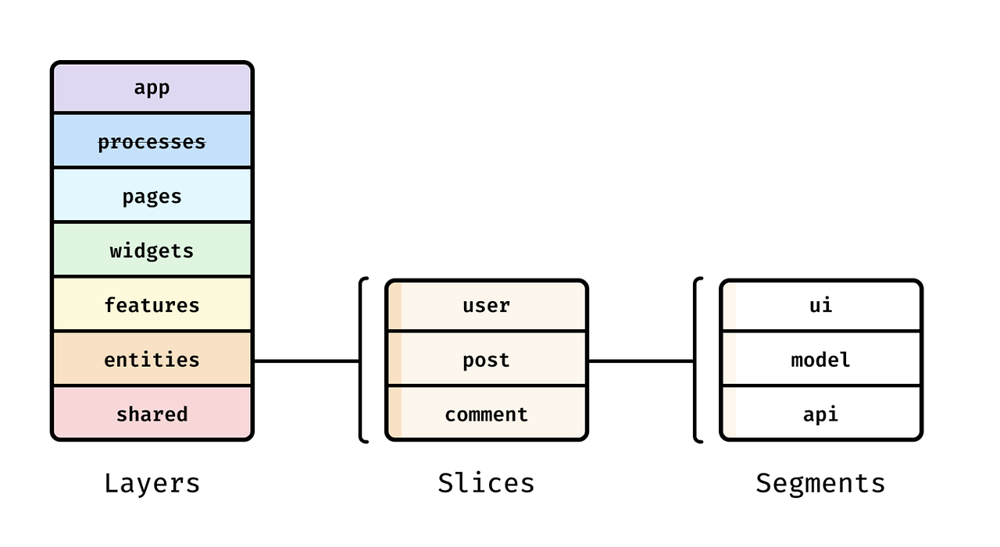

# 기능 분할 설계(Feature-Sliced Design, FSD)
**기능 분할 설계(Feature-Sliced Design, FSD)** 는 프론트엔드 프로젝트를 **`기능 단위`로 분리하여 관리하는 아키텍처 패턴**이다.     
컴포넌트나 페이지 중심이 아닌, **기능 중심**으로 코드를 구성하여 확장성과 유지보수성을 높이는 것이 목표이다.

## 1. FSD의 핵심 원칙
FSD는 다음과 같은 핵심 원칙을 기반으로 한다.

1. **도메인 중심 설계** :  애플리케이션을 "상품", "장바구니", "유저" 같은 도메인 단위로 구조화한다.
2. **계층화** : 코드를 여러 계층으로 구분하여 관심사를 분리한다.
3. **단방향 의존성** : 상위 계층은 하위 계층에만 의존할 수 있다.
4. **명시적 공개 인터페이스** : 각 모듈은 명확한 공개 API를 통해 상호작용한다.
5. **재사용성과 모듈화 향상** : 개별 Feature가 독립적으로 동작할 수 있도록 설계하여, 기능을 조합하고 확장하기 쉬운 구조를 만든다.

---


## 2. 기존의 폴더 구조 VS FSD
### 1) 기존의 폴더 구조 (컴포넌트 중심)
```bash
📂 src
 ├── 📂 components
 │    ├── Button.tsx
 │    ├── Input.tsx
 │    ├── Modal.tsx
 ├── 📂 pages
 │    ├── Home.tsx
 │    ├── Profile.tsx
 ├── 📂 services
 │    ├── api.ts
```

```tsx
// 기존 방식에서 "로그인 상태 확인"을 구현해야 할 때
import { getUser } from "../services/api";  // API 요청
import { setUser } from "../store/auth";   // Redux 상태 변경
import Button from "../components/Button"; // UI 컴포넌트

```
####  📌 기존 폴더 구조 문제점
- 여러 폴더에서 관련 코드를 찾아야 해서 **작업이 분산됨.**
- 컴포넌트와 상태 관리, API 호출이 각각 다른 폴더에 있어서 **하나의 기능을 개발할 때 여러 곳을 수정해야 함.**
- 규모가 커질수록 **`components/`, `pages/` 폴더가 비대해지고, 코드 관리가 어려워짐.**

### 2) FSD의 폴더 구조 (기능 단위 중심)
```bash
📂 src
 ├── 📂 app             # 앱의 기본 설정 (라우팅, 글로벌 상태, API 설정)
 ├── 📂 entities        # 핵심 도메인 모델 (유저, 상품 등)
 ├── 📂 features        # 개별 기능 단위 (로그인, 장바구니, 프로필)
 │    ├── 📂 auth
 │    │    ├── api.ts
 │    │    ├── model.ts
 │    │    ├── ui.tsx
 │    │    ├── index.ts
 │    ├── 📂 profile   
 │    │    ├── api.ts
 │    │    ├── model.ts
 │    │    ├── ui.tsx
 │    │    ├── index.ts
 │    ├── 📂 cart         
 │    │    ├── api.ts
 │    │    ├── model.ts
 │    │    ├── ui.tsx
 │    │    ├── index.ts
 ├── 📂 shared          # 공통적으로 사용하는 유틸, 훅, UI 컴포넌트
 ├── 📂 widgets         # 여러 Feature에서 공통으로 쓰이는 UI 블록
 ├── 📂 pages           # 페이지 단위 컴포넌트 (홈, 마이페이지 등)
 └── index.tsx
```
**FSD 적용 후, 관련 코드가 `features/auth/` 내부에 모두 존재!**
```tsx
import { getUser } from "@/features/auth/api";
import { setUser } from "@/features/auth/model";
import { LoginButton } from "@/features/auth/ui";
```

#### 📌 FSD 구조의 장점
- **기능별로 모든 관련 코드가 모여 있어 유지보수가 쉬움.**
    - `shared/`와 `widgets/` 폴더를 활용하여 공통 로직을 효율적으로 관리
    - 처음부터 기능 중심으로 나누기 때문에 큰 규모에서도 일관된 구조를 유지할 수 있음
- **새로운 기능을 추가하거나 수정할 때 다른 기능에 영향을 주지 않음.**
    - 불필요한 의존성을 줄이고 모듈 간 결합도를 낮출 수 있음
- **폴더 구조가 직관적이라서, "어디에 어떤 코드를 작성해야 하는지" 명확함.**

---

## 3. FSD의 구조


FSD는 `Layers`, `Slices`, `Segments`의 3개의 depth로 이루어져 있다.  
> 1️⃣ **레이어 (Layers)** → 앱 전체 구조를 `계층별`로 정리  
> 2️⃣ **슬라이스 (Slices)** → `기능(Feature)별`로 독립적인 모듈을 나눔  
> 3️⃣ **세그먼트 (Segments)** → Feature 내부에서 `역할별`로 파일을 정리

### 1) Layers (레이어)
**레이어**는 **FSD의 가장 상위 수준의 구조** 이다.   
각 레이어는 **특정한 책임**을 가지며, 애플리케이션의 **복잡성을 관리하는 데 도움**을 준다.  
각 계층이 역할을 분리하여 유지보수를 쉽게 만들고, 프로젝트의 일관성을 유지할 수 있도록 한다.


**📌 각 레이어의 역할**
| Layer  | 역할 | 예시 |
|--------|---------------------------------|-------------------------------------|
| **app** | 앱의 글로벌 설정, 라우팅, 상태 관리 설정 | |
| **processes** (선택적) | 여러 페이지에서 발생하는 비즈니스 로직  | `인증 흐름`, `결제완료 후 주문 생성` |
| **pages** | 페이지 단위 컴포넌트 | `HomePage`, `ProfilePage` |
| **widgets** | 여러 Feature에서 재사용되는 큰 UI 블록 |`SearchBar`, `Navbar`, `ProductCard` |
| **features** | 사용자 상호작용이 있는 개별 기능 | `로그인`, `댓글 작성`, `장바구니` |
| **entities** | 핵심 도메인 모델 | `User`, `Post`, `Product` |
| **shared** | 공통적으로 사용되는 유틸, 훅, 컴포넌트 | `Button`, `Input`, `Modal` |

> 각 레이어는 **하위 레이어에만 의존**할 수 있어, **단방향 데이터 흐름을 보장**한다!

---

#### app 레이어
- 애플리케이션의 진입점
- 전역 상태 관리, 라우팅 설정, 전역 스타일 정의
- 예: `src/app/index.tsx`, `src/app/store.ts`, `src/app/routes.ts`

#### processes 레이어 (선택적)
- 여러 페이지에서 연속적으로 진행되는 비즈니스 로직을 관리
- 예: 다단계 체크아웃 프로세스, 사용자 온보딩 흐름, 로그인 후 리디렉션, 결제 완료 후 주문 생성

#### pages 레이어
- 각 라우트에 해당하는 페이지 컴포넌트 정의
- **하위 위젯과 기능을 조합하여 전체 페이지 구성**
- 예: `src/pages/HomePage.tsx`, `src/pages/ProfilePage.tsx`

#### widgets 레이어
- 독립적인 UI 블록으로, 여러 기능을 조합할 수 있음
- **페이지 레이아웃의 주요 부분을 구성**
- 예: `src/widgets/Header`, `src/widgets/Sidebar`, `src/widgets/ProductList`

#### features 레이어
- 사용자의 행동(Action)과 관련된 UI, 상태 관리, API 요청을 포함
    - 로그인, 장바구니, 주문, 댓글 등
- **사용자와 상호작용하는 기능**을 관리
- 예: `src/features/auth/LoginForm` (로그인 기능), `src/features/cart/AddToCartButton`

#### entities 레이어
- 애플리케이션의 핵심 데이터 모델과 비즈니스 로직을 정의
    - User, Product, Order 같은 핵심 도메인
- features와 독립적으로 존재하며, **여러 features에서 재사용되는 데이터 구조**를 관리
    - **유저 데이터**는 **로그인**뿐만 아니라 **댓글 작성, 주문, 관리자 기능** 등에서도 사용될 수 있음.
    - 만약 User를 `features/auth/` 내부에서만 정의하면, 다른 기능에서 사용하기 어려움!
- 예: `src/entities/user.ts` (유저 데이터 모델), `src/entities/product.ts`, `src/entities/order.ts`  

#### shared 레이어
- 프로젝트 전반에서 사용되는 공통 유틸리티 및 UI 컴포넌트
- **비즈니스 로직과 무관한 재사용 가능한 코드**
- 예: `src/shared/ui/Button`, `src/shared/lib/api`, `src/shared/config`

---

### 2) Slices (슬라이스)
**슬라이스**는 각 레이어 내에서 특정 기능 영역이나 도메인을 나타내는 하위 디렉토리이다.

```bash
📂 features
 ├── 📂 auth      # Slice (로그인 기능 관련 코드)
 ├── 📂 cart      # Slice (장바구니 기능 관련 코드)
 ├── 📂 profile   # Slice (프로필 기능 관련 코드)
```
- FSD에서는 **기능 단위(Slice)로 코드를 분리**해서, 한 Feature가 다른 Feature에 의존하지 않도록 함.
    - 예를 들어 `auth/`는 로그인 관련 코드만 포함하고, `cart/`는 장바구니 관련 코드만 포함함.
    - 이렇게 하면 **기능을 추가하거나 수정할 때 영향 범위를 최소화할 수 있음**.

---

### 3) Segments (세그먼트)
**세그먼트**는 슬라이스 내부의 코드를 목적에 따라 더 세분화한 것이다.  
기능(Feature) 내부에서 **UI, 모델, API 호출 등을 별도로 관리**하여 코드의 응집도를 높이고 재사용성을 증가시킨다.

```bash
📂 features/auth      # Slice (기능 단위)
 ├── 📂 ui                 # Segment (UI 관련 컴포넌트)
 │    ├── LoginForm.tsx         # 로그인 UI 컴포넌트
 │    ├── SignupForm.tsx        # 회원가입 UI 컴포넌트
 ├── 📂 model              # Segment (상태 관리 및 비즈니스 로직)
 │    ├── authSlice.ts          # Redux/Zustand 상태 관리 (로그인 여부, 유저 정보)
 │    ├── authSelectors.ts      # Redux 셀렉터
 ├── 📂 api                # Segment (API 요청 및 서버 통신)
 │    ├── authApi.ts            # HTTP 요청 함수 (로그인, 회원가입)
 │    ├── authService.ts        # API 로직 정리 (토큰 관리 등)

```

- `ui/` → 컴포넌트 (React UI)  
- `model/` → 상태 관리, 로직  
- `api/` → 서버 요청 (fetch, axios 등)  

    - 이렇게 분리하면, **UI 코드와 비즈니스 로직(API, 상태 관리)이 섞이지 않아서 유지보수가 훨씬 쉬워짐**!


## 4. FSD 전체 구조 예시
```bash
📂 src
 ├── 📂 app             # layer: 앱의 기본 설정 (라우팅, 글로벌 상태, API 설정)
 │    ├── store.ts        # 전역 상태 관리
 │    ├── router.tsx      # 라우팅 설정
 │    ├── index.tsx       # 앱 진입점
 │
 ├── 📂 entities        # layer: 핵심 도메인 모델 (유저, 상품 등)
 │    ├── user.ts         # 도메인 모델: 유저 관련 데이터 구조
 │    ├── product.ts      # 도메인 모델: 상품 관련 데이터 구조
 │    ├── order.ts        # 도메인 모델: 주문 관련 데이터 구조
 │
 ├── 📂 features        # layer: 개별 기능 단위 (로그인, 장바구니, 프로필)
 │    ├── 📂 auth         # slice: 로그인 기능
 │    │    ├── 📂 ui          # segment: UI 관련 컴포넌트
 │    │    │    ├── LoginForm.tsx
 │    │    │    ├── SignupForm.tsx
 │    │    ├── 📂 model       # segment: 상태 관리 및 비즈니스 로직
 │    │    │    ├── authSlice.ts
 │    │    │    ├── authSelectors.ts
 │    │    ├── 📂 api         # segment: API 요청 및 서버 통신
 │    │    │    ├── authApi.ts
 │    │    │    ├── authService.ts
 │    │    ├── index.ts        # Barrel Export
 │
 │    ├── 📂 profile      # slice: 프로필 기능
 │    │    ├── 📂 ui          # segment: UI 관련 컴포넌트
 │    │    │    ├── ProfileCard.tsx
 │    │    │    ├── EditProfileForm.tsx
 │    │    ├── 📂 model       # segment: 상태 관리 및 비즈니스 로직
 │    │    │    ├── profileSlice.ts
 │    │    │    ├── profileSelectors.ts
 │    │    ├── 📂 api         # segment: API 요청 및 서버 통신
 │    │    │    ├── profileApi.ts
 │    │    │    ├── profileService.ts
 │    │    ├── index.ts        # Barrel Export
 │
 │    ├── 📂 cart         # slice: 장바구니 기능
 │    │    ├── 📂 ui          # segment: UI 관련 컴포넌트
 │    │    │    ├── CartList.tsx
 │    │    │    ├── CartItem.tsx
 │    │    ├── 📂 model       # segment: 상태 관리 및 비즈니스 로직
 │    │    │    ├── cartSlice.ts
 │    │    ├── 📂 api         # segment: API 요청 및 서버 통신
 │    │    │    ├── cartApi.ts
 │    │    │    ├── cartService.ts
 │    │    ├── index.ts       # Barrel Export
 │
 ├── 📂 shared          # layer: 공통적으로 사용하는 유틸, 훅, UI 컴포넌트
 │    ├── 📂 ui           # slice: 공통 UI 컴포넌트
 │    │    ├── Button.tsx
 │    │    ├── Input.tsx
 │    │    ├── Modal.tsx
 │    ├── 📂 hooks        # slice: 커스텀 훅
 │    │    ├── useDebounce.ts
 │    │    ├── useFetch.ts
 │    ├── 📂 lib          # slice: 공통 라이브러리 및 유틸
 │    │    ├── api.ts
 │    │    ├── formatter.ts
 │    ├── 📂 constants    # slice: 앱 전역 상수
 │    │    ├── roles.ts
 │    │    ├── apiRoutes.ts
 │
 ├── 📂 widgets           # layer: 여러 Feature에서 공통으로 쓰이는 큰 UI 블록
 │    ├── SearchBar.tsx
 │    ├── Navbar.tsx
 │    ├── ProductCard.tsx
 │
 ├── 📂 pages           # layer: 페이지 단위 컴포넌트 (홈, 마이페이지 등)
 │    ├── HomePage.tsx
 │    ├── ProfilePage.tsx
 │    ├── CartPage.tsx
 │
 └── index.tsx
```